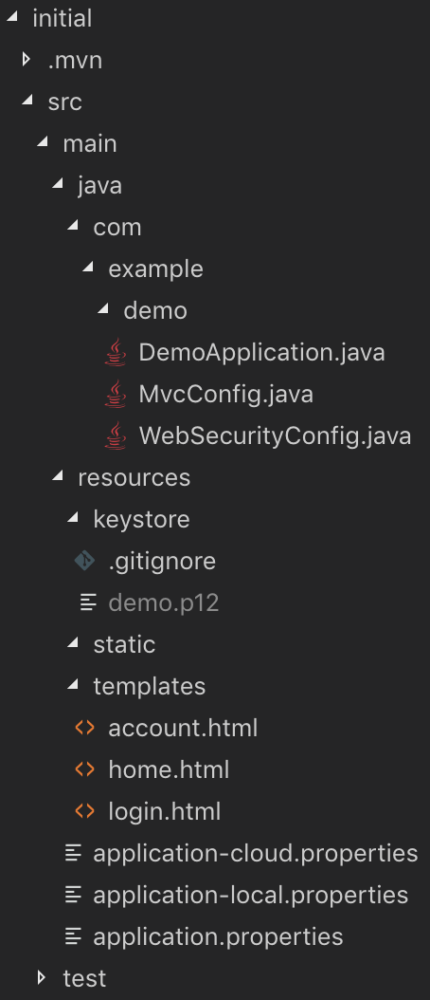
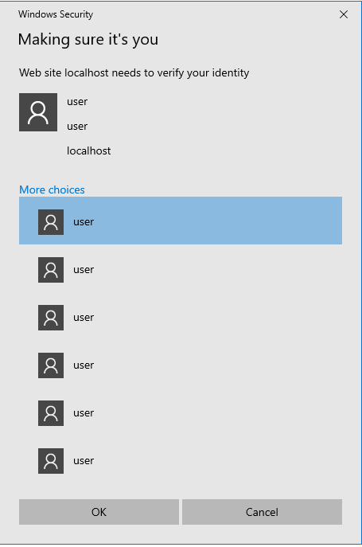
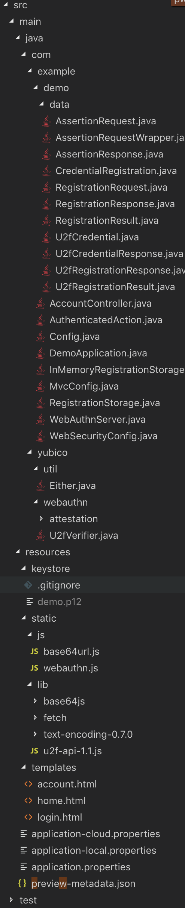
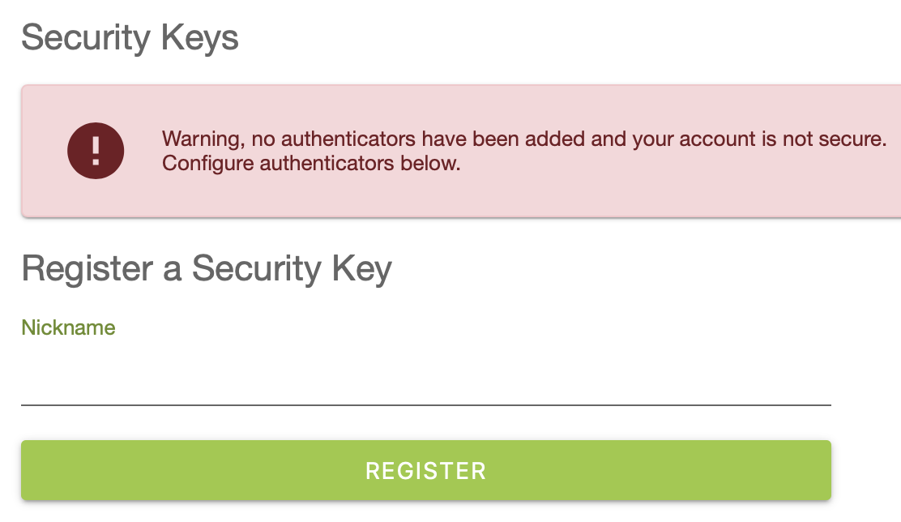

# Module 2: Credential Repository
In this module, you will add a credential repository to the application.

## Solution Architecture

### Initial web application structure 

<details>
<summary><strong>Expand for overview of existing web app structure</strong></summary><p>

]

**DemoApplication.java** initializes the Spring Boot application.

**WebSecurityConfig.java** configures Spring Security's web security support. This is where we configure the username and password and protect access to the account page.

**MvcConfig.java** configures Spring MVC to set up view controllers to expose the templates.

**templates** contain the pages for our web app. The html pages are where the JavaScript and Thymeleaf template code live.

**application.properties** configure the active spring profile and other spring properties.

</p></details>

### WebAuthn Server Overview
Yubico offers WebAuthn server libraries in various languages, one of which is the `java webauthn-server-core` library. The library tries to place as few requirements on the overall application as possible. For this reason it is stateless, database agnostic, and thread safe.

The main entry point is the `RelyingParty` class. It provides the inputs to the `navigator.credentials.create()` and `navigator.credentials.get()` methods and for processing their return values. In order to do this, the `RelyingParty` needs an instance of the `CredentialRepository` interface to use for looking up the credential IDs and public keys registered to each user.

The library provides four core operations:
* Initiate a registration operation given a user and some settings for the credential to be created
* Finish a registration operation given the initiation request and the authenticator response
* Initiate an authentication operation given a username
* Finish an authentication operation given the initiation request and the authenticator response

These operations perform all the verification logic specified by the W3C Web Authentication API, but it is the responsibility as the user of the library to store pending requests and act upon returned results, including enforcing policies and updating databases.

This workshop will use an in-memory database to store pending requests and credentials.

## Implementation overview
This section will walk through how to add the Java WebAuthn Server as a project, create an in-memory credential repository, and manage credential data through a Model-View-Controller.

**Important Note**

Because this workshop uses an in-memory credential repository, all credentials will disappear each time the application restarts. Since we are registering a resident credential on the authenticator itself, those credentials will become invalid after an application restart. The risk is that the authenticator will fill up with invalid resident credentials. Using a YubiKey is ideal for development environments such as this. If your YubiKey fills up with invalid credentials, you can remove all FIDO credentials by using the [YubiKey Manager](https://www.yubico.com/products/services-software/download/yubikey-manager/). Basically it resets the security key to factory default settings. 

Windows 10 example of multiple credentials on a security key. The top choice is typically the most recent credential registered.




### Dependency configuration
Open the ```pom.xml``` and add the webauthn-server-core and webauthn-server-attestation dependencies.
```xml
<dependency>
    <groupId>ch.qos.logback</groupId>
    <artifactId>logback-classic</artifactId>
    <version>1.2.3</version>
</dependency>
<dependency>
    <groupId>com.yubico</groupId>
    <artifactId>webauthn-server-core</artifactId>
    <!--Check for the latest version at Maven Central-->
    <version>1.2.0</version>
    <scope>compile</scope>
</dependency>
<dependency>
    <groupId>com.yubico</groupId>
    <artifactId>webauthn-server-attestation</artifactId>
    <!--Check for the latest version at Maven Central-->
    <version>1.2.0</version>
    <scope>compile</scope>
</dependency>
```

### Create a credential repository
The webauthn-server-core library contains a [`CredentialRepository`](https://yubico.github.io/java-webauthn-server/webauthn-server-core/com/yubico/webauthn/CredentialRepository.html) interface that is an abstraction of the database lookups. It is used by the [`RelyingParty`](https://yubico.github.io/java-webauthn-server/webauthn-server-core/com/yubico/webauthn/RelyingParty.html) to look up credentials, usernames and user handles from usernames, user handles and credential IDs. Implement the CredentialRepository interface with your database access logic. 

In this workshop we will reuse the [`InMemoryRegistrationStorage`](https://github.com/Yubico/java-webauthn-server/blob/master/webauthn-server-demo/src/main/java/demo/webauthn/InMemoryRegistrationStorage.java) implementation from the [webauthn-server-demo](https://github.com/Yubico/java-webauthn-server/tree/master/webauthn-server-demo).

### Get the webauthn-server-demo credential repository resources
We will be using some resources from the webauthn-server-demo in our project.

<details>
<summary><strong>Step-by-step instructions to get the resources</strong></summary><p>

1. Verify you are in the  `PasswordlessWorkshop/initial` directory
2. Open `getLibs.sh` or `getLibs.ps1` in your editor take a look at what it does
    1. First it clones the java-webauthn-server repo
    2. Next the webauthn-server-demo data and yubico packages are copied to the project
    3. Then the AuthenticatedAction, Config, InMemoryRegistrationStorage, and RegistrationStorage, preview metadata, lib, and js content are copied to the project
    4. Finally, the webauthn-server-demo package names and renamed to match our project structure. Some of the java files that were copied over had an incorrect package name. For each file we replace 'demo.webauthn' with 'com.example.demo'. 
3. Run the getLibs script
   
   Bash:
   ```bash
   ./getLibs.sh
   ```

   PowerShell (May need to run a second time if ./src/main/resources/static/lib folder does not exist):
    ```
    ./getLibs.ps1
    ```

4.  Validate build success
    Change directory back to the initial folder and run:
    ```
    mvn clean package
    ```

</p></details>

### Review the new resources

<details>
<summary><strong>Expand for overview of the new resources</strong></summary><p>

]

**WebAuthn Data Entities** 

The `data` folder contains the data entities used by the WebAuthn Server. 

* The `RegistrationRequest`, `RegistrationResponse`, and `RegistrationResult` classes are used to pass data through the registration API
* The `CredentialRegistration` class is used to store registration data
* The `AssertionRequestWrapper`, `AssertionResponse`, and `AssertionResult` classes are used to pass data through the authentication API

**Config.java** 

Use environment variables to configure the WebAuthn Server.

- `YUBICO_WEBAUTHN_PORT`: Port number to run the server on. Example:
    `YUBICO_WEBAUTHN_PORT=8081`

- `YUBICO_WEBAUTHN_ALLOWED_ORIGINS`: Comma-separated list of origins the
server will accept requests for. Example:
`YUBICO_WEBAUTHN_ALLOWED_ORIGINS=http://demo.yubico.com:8080`

- `YUBICO_WEBAUTHN_RP_ID`: The [RP ID](https://www.w3.org/TR/webauthn/#rp-id)
the server will report.  Example: `YUBICO_WEBAUTHN_RP_ID=demo.yubico.com`

- `YUBICO_WEBAUTHN_RP_NAME`: The human-readable
[RP name](https://www.w3.org/TR/webauthn/#dom-publickeycredentialentity-name)
the server will report. Example: `YUBICO_WEBAUTHN_RP_ID='Yubico Web
Authentication demo'`

- `YUBICO_WEBAUTHN_RP_ICON`: An optional URL to an
[icon](https://www.w3.org/TR/webauthn/#dom-publickeycredentialentity-icon) to
represent this Relying Party. Example:
`YUBICO_WEBAUTHN_RP_ICON='https://www.yubico.com/wp-content/uploads/2014/09/favicon.ico'`

**InMemoryRegistrationStorage.java**

The `InMemoryRegistrationStorage` implements the `RegistrationStorage` and `CredentialRepository` interfaces and stores credential registrations in memory.

**RegistrationStorage.java**

The `RegistrationStorage` class is an interface that extends the `CredentialRepository` interface and adds methods to help manage registrations.

**WebAuthnServer.java**

This layer manages the general architecture of the system, and is where most business logic and integration code would go. The demo server implements the "persistent" storage of users and credential registrations - the `CredentialRepository` integration point - as the `InMemoryRegistrationStorage` class, which simply keeps them stored in memory for a limited time. The transient storage of pending challenges is also kept in memory, but for a shorter duration.

The logic for authorizing registration of additional credentials, and de-registration of credentials, is also in this layer. In general, anything that would be specific to a particular Relying Party (RP) would go in this layer.

**Yubico Utils**

The `yubico` folder contains utility classes used by the WebAuthnServer. Note the `Either` class is used to return either a successful result or an error string.

**js and lib static resources**

The `js` and `lib` folders contain javascript libraries which help process the WebAuthn requests and responses.

**preview-metadata.json**

The `preview-metadata.json` stores metadata for known/trusted authenticators.

</p></details>

### Update the WebAuthn Server to return security keys registered to a user

<details>
<summary><strong>Step-by-step instructions to get user registrations from the database</strong></summary><p>

1. Open `./src/main/java/com/example/demo/WebAuthnServer.java` in your editor.
2. Add the following method to the class
   ```
   public Collection<CredentialRegistration> getRegistrationsByUsername(String username) {
        return this.userStorage.getRegistrationsByUsername(username);
    }
   ```
3. Make newly created method accessible to controllers by adding the @Service annotation
   ```
   import org.springframework.stereotype.Service;

   @Service
   public class WebAuthnServer {
   ```

</p></details>

### Setup an Account Controller to show security key details in the account view

<details>
<summary><strong>Step-by-step instructions to show user registrations</strong></summary><p>

1. Create AccountController.java
   ```
   echo '' > ./src/main/java/com/example/demo/AccountController.java
   ```
2. Open `./src/main/java/com/example/demo/AccountController.java` in an editor and create the following class
    ```java
    package com.example.demo;

    import java.security.Principal;

    import org.springframework.beans.factory.annotation.Autowired;
    import org.springframework.stereotype.Controller;
    import org.springframework.ui.Model;
    import org.springframework.web.bind.annotation.GetMapping;

    @Controller
    public class AccountController {

        @Autowired
        private WebAuthnServer webAuthnServer;

        @GetMapping("/account")
        public String registerAll(Principal principal, Model model) {
            model.addAttribute("registrations", webAuthnServer.getRegistrationsByUsername(principal.getName()));
            return "account";
        }
    }
    ```
3. Open `./src/main/resources/templates/account.html` in an editor and add the following to the body section.
    ```javascript
        <div class="card card--internal">
            <h2 class="section-header">Security Keys</h2>
            <div th:if="${registrations.empty}" class="card card--error" id="no-keys">
                <svg focusable="false" viewBox="0 0 24 24" aria-hidden="true" role="presentation">
                    <path fill="none" d="M0 0h24v24H0z"></path><path d="M12 2C6.48 2 2 6.48 2 12s4.48 10 10 10 10-4.48 10-10S17.52 2 12 2zm1 15h-2v-2h2v2zm0-4h-2V7h2v6z"></path>
                </svg>
                <p>Warning, no authenticators have been added and your account is not secure. Configure authenticators below.</p>
            </div>
            <table class="table" id="keys" th:classappend="${registrations.empty}? 'hide'">
                <thead>
                    <tr>
                        <th> Nickname </th>
                        <th> Registration Time </th>
                    </tr>
                </thead>
                <tbody id="keys">
                    <tr th:each="registration : ${registrations}" >
                        <td><span th:text="${registration.credentialNickname.get()}"> NickName </span></td>
                        <td><span th:text="${registration.registrationTime}"> Registered </span></td>
                    </tr>
                </tbody>
            </table>
        </div>
    ```

</p></details>

### Configure WebAuthn Server for Azure Web App Service

<details>
<summary><strong>Step-by-step instructions to set WebAuthn Server environment variables</strong></summary><p>

1. Open `./pom.xml` in your editor
2. Add the following to the `appSettings` to the `azure-webapp-maven-plugin` plugin
    ```xml
    <appSettings>
        <property> 
            <name>JAVA_OPTS</name> 
            <value>-Dserver.port=80</value> 
        </property>
        <property> 
            <name>YUBICO_WEBAUTHN_ALLOWED_ORIGINS</name> 
            <value>https://${WEBAPP_NAME}.azurewebsites.net</value> 
        </property>  
        <property> 
            <name>YUBICO_WEBAUTHN_PORT</name> 
            <value>80</value> 
        </property> 
        <property> 
            <name>YUBICO_WEBAUTHN_RP_ID</name> 
            <value>${WEBAPP_NAME}.azurewebsites.net</value> 
        </property> 
        <property> 
            <name>YUBICO_WEBAUTHN_RP_NAME</name> 
            <value>'Yubico Web Authentication demo'</value> 
        </property>
        <property> 
            <name>YUBICO_WEBAUTHN_U2F_APPID</name> 
            <value>https://${WEBAPP_NAME}.azurewebsites.net</value> 
        </property>
    </appSettings>
    ```

</p></details>

### Validate web app works as expected
1. Run the web app
    
    Locally
    ```
    mvn clean package spring-boot:run
    ```

    Azure Cloud Shell
    ```
    mvn clean package azure-webapp:deploy
    ```
   
2. Open the web app URL (The local URL is https://localhost:8443/)
3. Log in and go to the account page.
4. You should see no security keys registered

    

## Recap
* Added the WebAuthn server dependencies from Maven Central to the build file
* Added the WebAuthnServer class and dependencies from the webauthn-server-demo project
* Implemented a Model-View-Controller (MVC) pattern to show a user's security keys

## Next
Once you have finished this section, you may proceed to the next module, [Registration](../3_Registration/README.md)
