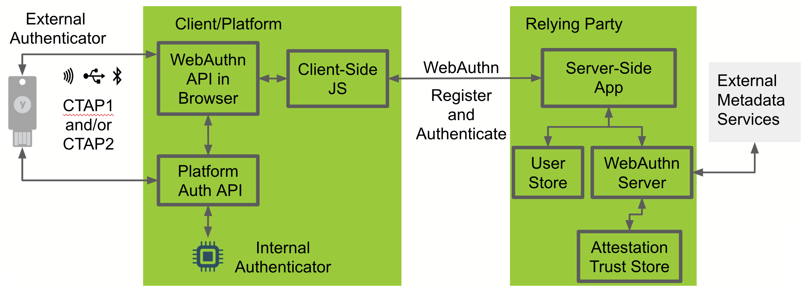
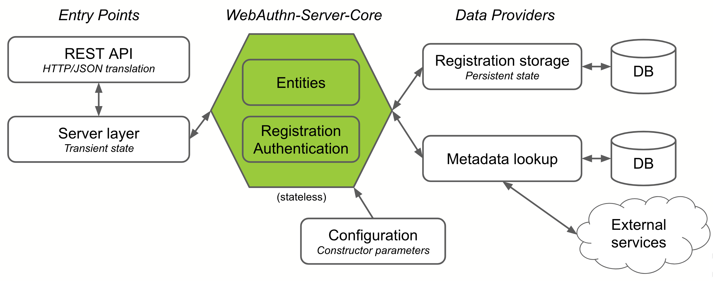

# Securing a Website with Passwordless Authentication
In this workshop you will build a simple web application that enables users to register a security key and then use the security key to sign in without typing in a username or password.

<details>
<summary><strong>TLDR</strong></summary><p>

If you'd rather see the end result without installing the dependencies and going through all the steps then do this _(requires docker)_:
1. Clone the repo
   ```
   git clone https://github.com/elukewalker/PasswordlessWorkshop
   ```
2. Build the docker image
   ```
   build -t example/demo:latest PasswordlessWorkshop/4_Authentication/complete/.
   ```
3. Run the image
   ```
   docker run -p 8443:8443 example/demo:latest
   ```
4. Open `https://localhost:8443/` in a CTAP2 compatible browser (Edge on Windows 10 1809+ or Safari Technology Preview on macOS)
5. Sign in with username `user` and password `password`
6. Register a security key
7. Sign out
8.  Click `Passwordless sign in` to sign in without typing a username or password

<p></details>

## What you'll build:
You'll start with a java web application that secures access to a page with a login form. Then you'll integrate Yubico's WebAuthn Server libraries to enable FIDO2 security key registration and passwordless authentication. 

## What you'll need:
* [Git](https://git-scm.com/)
* [JDK 1.8](https://www.oracle.com/technetwork/java/javase/downloads/index.html) or later
* [Maven 3.2](https://maven.apache.org/download.cgi)+
* FIDO2 Compatible browser
  * MacOS: [Safari Technical Preview](https://developer.apple.com/safari/technology-preview/) version 71+
  * Windows 10 Version 1809+: Edge
* A favorite text editor or IDE
* A security key
* [Optional] An [Azure](https://azure.microsoft.com/) Subscription. If you already have a subscription you can use it or you can get a free trial [here](https://azure.microsoft.com/free/).


### High Level Components


**FIDO2 Authenticator:**
The authenticator makes credentials, generates cryptographic proof of user authentication, and manages the PIN.

**Client:**
The client is the bridge between the authenticator and the server. It implements the FIDO2 Client to Authenticator Protocol (CTAP) and the WebAuthn API. The client could be a browser exposing the WebAuthn API to web applications, or an OS subsystem exposing a platform-specific FIDO2 API to native applications such as mobile or desktop apps.

**Server:**
The server, also know as Relying Party or RP, consists conceptually of at least a web server and the server-side portions of a web application, plus a WebAuthn server. The WebAuthn server has a trust store, containing the (public) trust anchors for the attestation of FIDO2 Authenticators. Note: a trust store is needed only if RP cares about attestation metadata.

See the diagram below for a depiction of the server architecture


#### Additional WebAuthn Resources
If you need more resources to understand WebAuthn and FIDO2 then
* Read the [WebAuthn Developer Guide](https://developers.yubico.com/FIDO2/FIDO2_WebAuthn_Developer_Guide/Overview.html)
* Review the [Java WebAuthn Server Library Code](https://github.com/Yubico/java-webauthn-server)
* Watch the [Developer Videos](https://www.yubico.com/why-yubico/for-developers/developer-videos/)

# Modules
This workshop is split into multiple modules. Each module builds upon the previous module as you expand the application. You must complete each module before proceeding to the next.

1.	**Getting Started**
2.	**Credential Repository**
3.	**Registration**
4.	**Authentication**
1.  **Clean Up**

# Getting Started
Before you begin, make sure you have completed the steps in the [Getting Started Module](./1_Getting_Started/README.md)